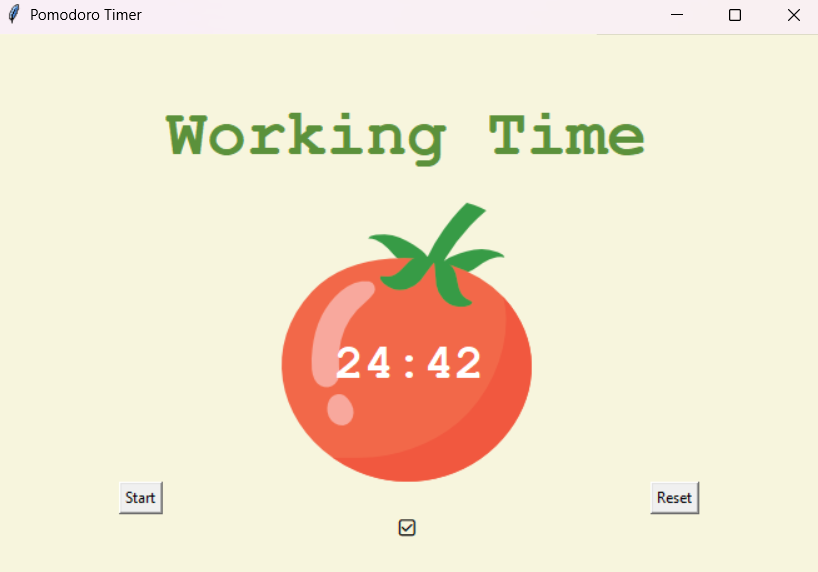

# Day 28
## Project with tkinter GUI
### Main Project 28: Building a Pomodoro App
This project with tkinter works as a timer for the pomodoro technique, which is
a productivity method, in which one works for 25 minutes and rests for 5, three times
in a roll, and then takes a longer rest of 20 minutes. The App contains a button to start
the timer, to reset it to the beginning of the current section (either work or rest), 
and also shows how many working sections have already been taken, by displaying a checkmark
under the timer after each working+rest section.

