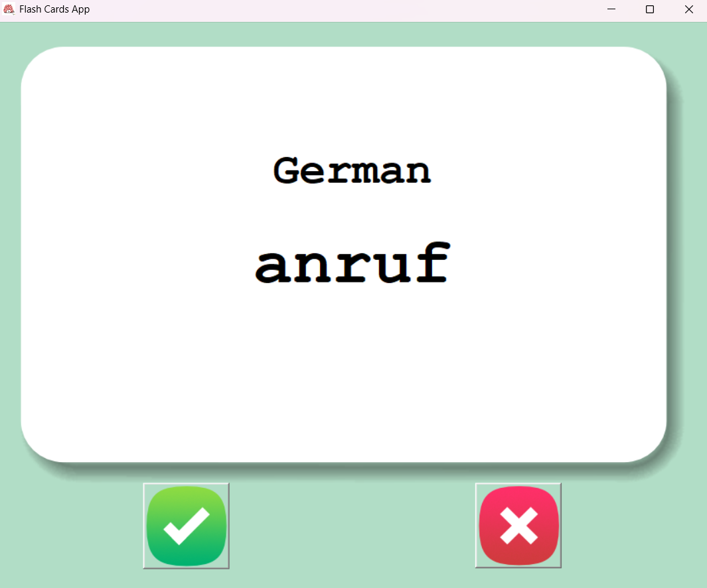
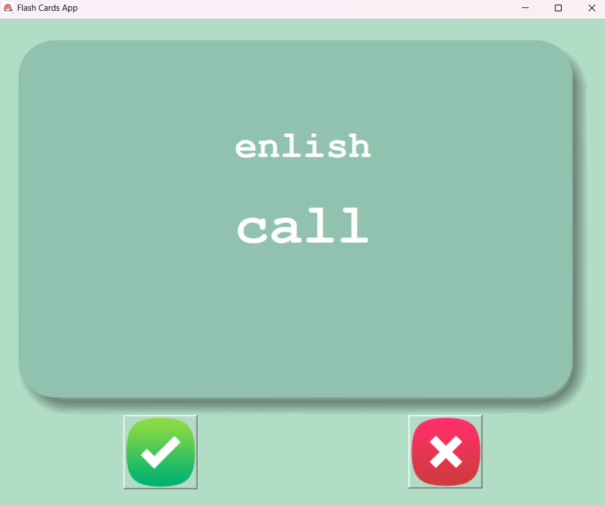

# Day 31
## Flash Card Project
Today's goal was to develop an App that helps the user 
memorize words in a foreign language (german in this case).
The application shows a flashcard containing a word and its language.
If the user already knows the word, they press the checkmark button and
goes to the next word. This word is deleted from the csv file "to_learn.csv",
so that it doesn't appear again. If the user presses the red X button, the translation
of the word is going to be shown.
The data with almost 2000 words in german have been uploaded from a github repository that 
contains the most common words in different languages. They were all translated using 
google sheets and later downloaded as a .csv file

