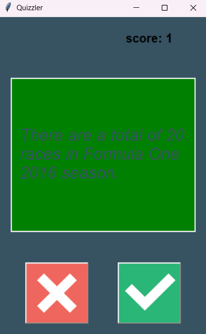
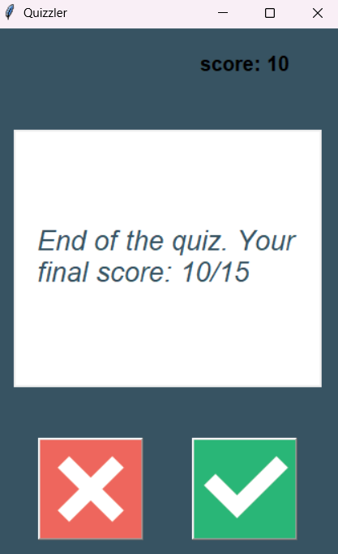

# Day 34: Quiz App
In this app, 15 boolean questions are requested from the Open Trivia Database API.
These 15 questions are added to a questions list in the form of a question_model, 
which contains a question and its correct answer. The User Interface displays the question
and two buttons, true or false. If the user gets it correctly, the question box becomes green and the score
is increased. The box goes red otherwise. By the end, the total score is displayed.

