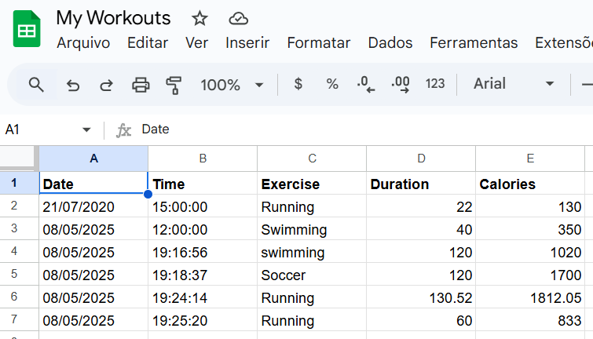

# Daily Exercise Logger with Nutritionix and Google Sheets
In this project, the user is asked to give
the physical exercises they did in a given day.
This information will be processed by the natural
language model from Nutritionix api, that will return
a json containing data like calories and duration,
which will be added to a formatted Google sheets document
by using the Sheety api.

