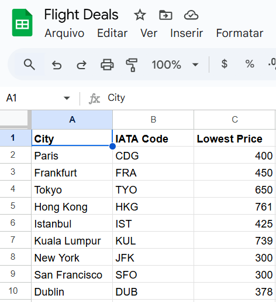

# Flight Deal Notifier with Google Sheets Integration
This program monitors flight prices for trips departing from Rio de Janeiro using the Flight Search API.
It compares current prices with predefined target prices listed in a Google Sheets document, accessed via the Sheety API.
When a flight to any destination is found below the target price, the program automatically sends an email to notify the 
user with the details of the deal.

