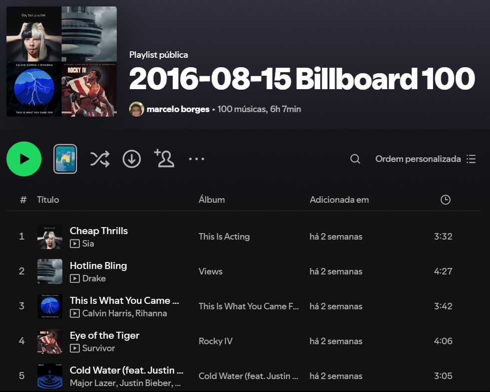
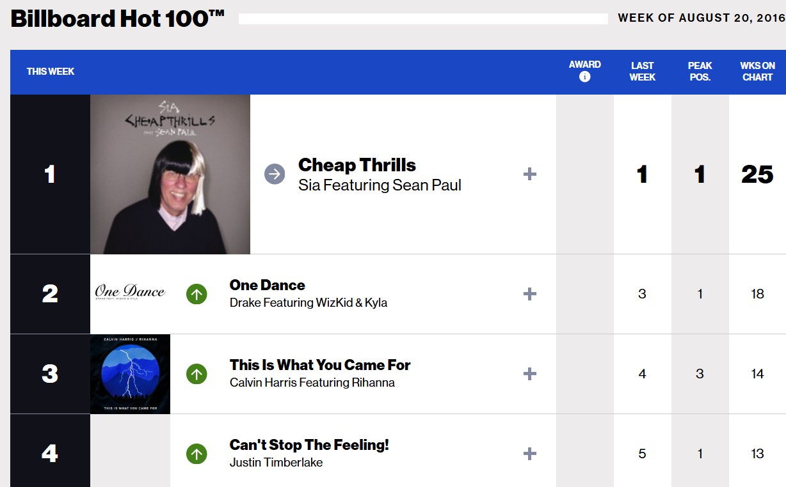

# Billboard to Spotify Playlist Generator
For a given date, this program searches for the 100 most listened songs in Billboard using BeautifulSoup,
and creates a playlist in spotify with all of these songs using the Spotipy module.

