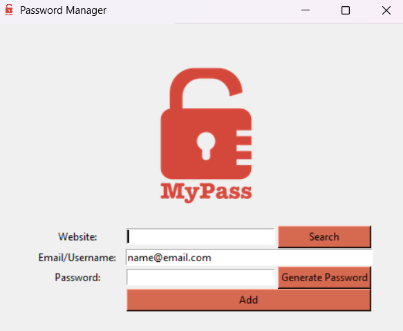

# Day 29 and 30: Password Manager
### New concepts: exceptions handling and json files 
Another project with tkinter was developed in days 29 and 30: a password manager.
The user inputs the website, the email/username and the password, which can
be randomly generated by de generate_password() function. The information can
be submitted only after filling all the fields. Otherwise, a pop-up window shows
and displays a message. After submitting all the infos, another pop-up asks the 
user to confirm them. The search functionality displays the email and the password
registered for a website request. If the requested website has not been registered yet,
the user is informed of so. A default email can be set, so that every time the program 
runs, it is already going to be written in the email field. The data is stored in a json 
file, which makes it a lot easier to search for website requests. It is necessary to 
insert a password in the entry frame, before accessing the actual application.

